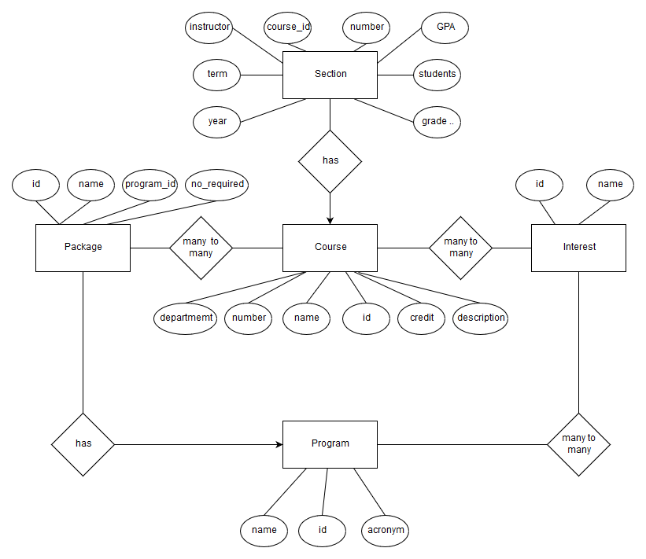

## Project description


The URL of this app: <http://165.227.22.37:8080/>


### Background


This web application is designed to provide a course searching engine for A&M students, especially for the graduate students in the department of CSE. 


Normally, the section information for previous semesters, such as instructor, average GPA, etc. can be obtained on A&M registar report. However, it's inconvenient for us students to use, since it's organized by semester. If we want to check a course for last 3 years, we would need to download 9 PDF reports and search that course in each of them. It's not straightforward if we want to compare the results across different semesters. Usually, students spend hours collecting helpful data if they want enough information. Some of them may just give up and go with recent 1 or 2 grade reports since this process is quite tedious and time-consuming.


To solve this problem, this web application collect all course catalog data and section report data and stored them in database. It will show the information organized by each course. It is easy to compare section information across different semesters , thus to help students choose the right course section for them. 


Meanwhile, students can search courses not only with the course ID or name, but also based on their degree programs. This application implements some course related information in the graduate brochure for graduate students in the department of CSE. Students can check them using categorical search.


Furthermore, the registar reports don't have any other information like course full name, credit and description. This web application will provide such information to users for their convenience. Therefore, it is a complete and convenient tool for A&M students for choosing courses. 


### Services


As mentioned, this web app provides two ways for users to get course information: keyword search and categorical search.


#### Keyword search


Users can search courses by entering any combination of "Department", "Number" and "Name", thus do fuzzy search. For example, if a user enters "CSCE" for "Department" and "608" for "Number", only one course "CSCE 608 Database Systems" will be presented. If the the searching criterion is "Name: database", CourseLookr will return a list of courses whose names consist of "database". "CSCE 608 Database Systems" will be in this list. Students can open the course detail page here for detailed information. The course information can be updated by users on this detail page.


#### Categorical search


For graduate students in the department of CSE, this web app provides categorical search. Students can click their degree program on the home page. It will list the required course packages and course packages based on interest. To fulfill their degree plan, students must pick a specified number of courses from each required package. Meanwhile, CourseLookr also provides course packages based on interest. Students can click their interested packages and check courses inside. Students will see a list of courses in the package page.  The course detail page can be accessed here. Users can also add or delete courses from packages to help this application better.


## Data collection


The data used in this application was retrieved from three sources as below.


1. A&M course catalog
    - course ID, name, credit, description
    - URL: <http://catalog.tamu.edu/>
2. A&M registar report
    - previous section information
    - URL: <https://web-as.tamu.edu/gradereport/>
3. A&M CSE department graduate brochure
    - graduate degree program information
    - URL: <https://engineering.tamu.edu/cse/academics/graduate-program>


### Course catalog


The catalog information is relatively easy to retrieve since it's web-based and well structured. A web crawler built with python is used to get all information and save them in `csv` format. 5309 rows was retrieved. The source code can be found at <https://github.com/melonskin/scrapeCourse>.  


### Registar report


First, A web crawler is used to download those reports for 3-year period, which are in PDF-format. Then, an OCR API developed by google is implemented to convert those PDF into txt files. Those data is processed, cleaned and saved in `csv` format. 48491 rows were retrieved. The code is at  <https://github.com/melonskin/scrapeCourse>.


### CSE graduate brochure


The degree program and course package information are input manually, since it is relatively short and need some understanding.


### Import into database


The data is imported into database using SQL `INSERT`. Before that, corresponding tables are created. For example, following SQL queries will create Course table and insert a record.


```sql
DROP TABLE IF EXISTS `course`;
CREATE TABLE `course`  (
  `id` int(255) NOT NULL AUTO_INCREMENT,
  `Department` varchar(255) CHARACTER SET utf8 COLLATE utf8_general_ci NOT NULL,
  `number` varchar(255) CHARACTER SET utf8 COLLATE utf8_general_ci NOT NULL,
  `Name` varchar(255) CHARACTER SET utf8 COLLATE utf8_general_ci NOT NULL,
  `credit` varchar(255) CHARACTER SET utf8 COLLATE utf8_general_ci NOT NULL,
  `description` longtext CHARACTER SET utf8 COLLATE utf8_general_ci NOT NULL,
  PRIMARY KEY (`id`) USING BTREE
) ENGINE = InnoDB AUTO_INCREMENT = 1 CHARACTER SET = utf8 COLLATE = utf8_general_ci ROW_FORMAT = Dynamic;
```


```sql
INSERT INTO `course` VALUES (1, 'ACCT', '209', 'Survey of Accounting Principles', '3', 'Accounting survey for non-business majors; non-technical accounting procedures, preparation and interpretation of financial statements and internal control. May not be used to satisfy degree requirements for majors in business. Business majors who choose to take this course must do so on a satisfactory/unsatisfactory basis.');
```


## E-R diagram of DB


The E-R diagram is plotted as Fig. 1.


{ height=70% }


### Discussion


This database design has five entities: `Course`, `Section`, `Program`, `Package` and `Interest`. The relations between them are:


1. `Course` one to many `Section`
2. `Program` one to many `Package`
3. `Program` many to many `Interest`
4. `Package` many to many `Course`
5. `Interest` many to many `Course`


With the database design mentioned above, the E-R diagram can be generated. 


For the application, `Course`, `Section` are used to store the course information crawled online.  User do keyword search in `Course` table based on its attributes. For every course, we could query its sections to check.


`Program`, `Package` and `Interest` consist of degree plan information in the graduate brochure. They basically support the categorical search service. For example, `Package` and `Course` have a relationship between them, it represents a course package consists of several courses. Therefore, when user queries for the courses of a package, the application will return a list of courses needed. 


## Table normalization


Based on the E-R diagram, the database schema is constructed.


### Database schema


There are 8 tables in total. Five of them store five entities. Other 3 are tables consisting of two foreign keys columns handling many-to-many relations between those entities. They are `Interest_courseship`, `Package_courseship` and `Program_interestship`. 


The structures of tables are shown as below.


#### Course


| Field     |Key    |
|----------|---|
| id       |PRI |
| department| |
| number     | |
| name   | |
| credit  | |
| description | |


Note that an auto-incremented `id` attribute is introduced in this table to be the primary key (PRI). The reason is that if we use `department` and `number` as primary keys, we basically cannot change those values, otherwise, it will cause update anomalies to other tables with this attribute as a foreign key (FOR).  This update is totally possible, such as from `CPSC` to `CSCE` as I know. So to be safe, this unique `id` in introduced.


#### Section     


| Field     |Key    |
|----------|---|
|course_id  | PRI, FOR |
|number |PRI |
|instructor| |
|term   | PRI |
|year   | PRI |
|GPA    | |
|student    | |
|Grade ... |  |


#### Program


| Field     |Key    |
|----------|---|
|id |PRI    |
|name   |
|acronym    |


#### Package


| Field     |Key    |
|----------|---|
|id | PRI |
|program_id | FOR |
|name   |   |
|no_required |  |


#### Interest


| Field     |Key    |
|----------|---|
|id |PRI    |
|name   | |


#### Package_courseship


Similarly for other "ship" tables.


| Field     |Key    |
|----------|---|
|package_id |PRI, FOR |
|course_id |PRI, FOR |  


### Discussion


Table normalization is unnecessary for our current database design to satisfy BCNF. The definition of BCNF is:


A relation $R$ is in BCNF if and only if: whenever there is a nontrivial FD $A_1 A_2...A_n \rightarrow B_1 B_2 ... B_m$ for $R$, it is the case that $\{A_1, A_2, ..., A_n\}$ is a superkey for $R$


For those tables with a unique `id` attribute, we can observe that there are no FD within other attributes, so any non-trivial FD must consist of `id` attribute on the left side, thus every tuples on the left side will be unique, in other words, superkey. So these tables are in BCNF. Similarly, for other tables with multiple primary keys, any non-trivial FD must have those primary keys on the left side. Meanwhile, the combination of values of primary keys for a record is unique. Therefore, tuples on the left side of FD are unique, superkey. These tables are in BCNF.


## User interface


The web-based user interface is built with Java Spring/SpringMVC for framework, MySQL for DBMS, Tomcat for web server, maven for dependency management, Bootstrap for front-end beautify and git for version control. Finally, it was deployed on a ubuntu server rent from DigitalOcean.


There are 7 pages in total. Introduction of those pages is given as below.


### Home page


The home page consists of two blocks: course search and program category, shown in Fig. 2.


{ height=50% }


#### Search block


Users can search courses by entering any combination of three searching keywords. 


#### Program category


Six degree programs in the department of CSE are shown here. Students can click on "View" button of those programs to get into program page. Those program information are obtained by executing following SQL.


```sql
SELECT * FROM program;
```


Once click "View", the SQL query executed is as below.


```sql
SELECT * FROM program WHERE id = ?;
```


### Search result page


The search result page will show a list of courses matching the searching criteria as Fig. 3. Users can click "View" button to go to the course page they are interested in.


Based on the user-input parameter, the GUI will do search with following SQL query. It will pick first 25 matching records.


```sql
SELECT id, department, number, name, credit, description
            FROM course
            WHERE department LIKE ? AND number LIKE ? AND name LIKE ? LIMIT 25;
```


{ height=50% }


### Course page


#### Course detail


The course page shown in Fig. 4 will show course detail including name, credit, description and previous section information. User can click "Edit course" button if they want to update course information.


{ height=50% }


Following SQL queries are executed to obtain course information and section information.


```sql
SELECT id, department, number, name, credit, description
            FROM course
            WHERE department = ? AND number = ? LIMIT 1;

SELECT * FROM section WHERE course_id = ? ORDER BY year ASC, term ASC;
```


#### Course update page


Users can update course information on this page as shown in Fig. 5. For safety purpose, only name, credit and description are allowed to be updated. Validations will be executed while processing an update request.


The update is done by executing SQL as below.


```sql
UPDATE course SET name = ?, credit = ?, description = ? WHERE id = ?;
```


{ height=50% }


### Program page


The program page will show related required course packages and interested course packages in Fig. 6. Users can click the "View" button to check the courses inside packages.

The program, package and interest information are obtained with following SQL queries.


```sql
SELECT * FROM program WHERE id = ?;

SELECT * FROM package WHERE program_id = ?;

SELECT * FROM interest WHERE id IN 
            (SELECT interest_id FROM program_interestship WHERE program_id = ? );
```


{ height=50% }


### Package page


The package page will show courses in this package shown in Fig. 7. Course detail page can be accessed here. It also present how many courses are required in this package. Also, users can add or delete courses in this package.


The package information is obtained by SQL query as below.


```sql
SELECT * FROM program WHERE id = ?;
```


Courses are chosen with the SQL query as 


```sql
SELECT * FROM course WHERE id IN 
        (SELECT course_id FROM package_courseship WHERE package_id = ? );
```


Insert and delete courses from package can be done with following SQL.


```sql
INSERT INTO package_courseship (package_id, course_id)
             VALUES(?, ?) ON DUPLICATE KEY UPDATE package_id=package_id;

DELETE FROM package_courseship 
            WHERE package_id = ? AND course_id = ?;
```


{ height=50% }


### Interest page


The interest page functions similarly as the package page, as shown in Fig. 8.


The interest package information is obtained by SQL query as below.


```sql
SELECT * FROM interest WHERE id = ?;
```


Courses are chosen with the SQL query as 


```sql
SELECT * FROM course WHERE id IN 
        (SELECT course_id FROM interest_courseship WHERE interest_id = ? );
```


Insert and delete courses from interest package can be done with following SQL.


```sql
INSERT INTO interest_courseship (interest_id, course_id)
            VALUES(?, ?) ON DUPLICATE KEY UPDATE interest_id=interest_id;

DELETE FROM interest_courseship 
            WHERE interest_id = ? AND course_id = ?;
```


{ height=50% }


## Project source code


1. Application source code can be found at <https://github.com/melonskin/courseLookr>
2. Data retrieval source code can be found at <https://github.com/melonskin/scrapeCourse>


## Discussion


Initially, developing a good database schema is challenging to me. I tried to understand it better by reading textbook and looking through online discussion, both piazza and other forums. Professor and TA answered my questions completely. Based on my understanding, I designed my database schema and optimized it several times to make it more reasonable.


I developed the user interface with Java Spring/SpringMVC framework, which I haven't touched before. By reading books and tutorials, I achieved my project from scratch. I learned a lot about what I have used and some basic concepts related to web and network.


The deployment is really a painful but last part of this project. First I developed this application locally on my PC. It works well. For online deployment, I compared those server providers and give up Heroku. Because it does not support MySQL. I have used Heroku before and really like deploying app with only several command in it. Finally, I chose DigitalOcean and configured a blank ubuntu server, installing MySQL, Tomcat, php and other dependencies. A lot of weird problems came out. I struggled to figure all of them out. Especially, I chose a server with 512MB memory initially. It caused me tons of trouble. It took me hours to find that most of problems were related to low memory. Once I upgraded to a server with larger memory, the world is peaceful again. However, during this process, I got a better understanding of linux system, managing database and jobs on server.